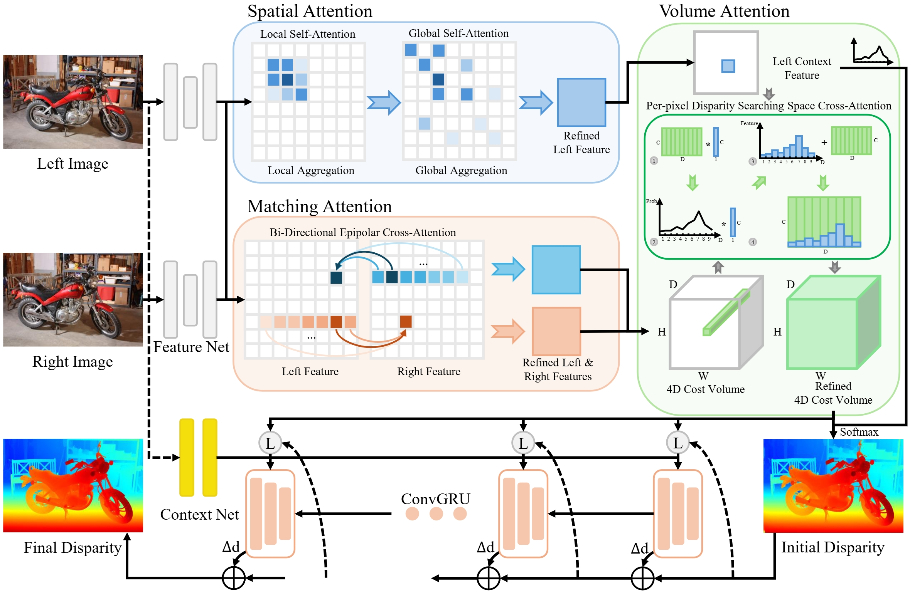
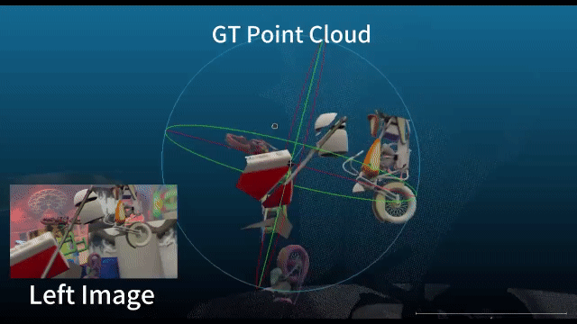
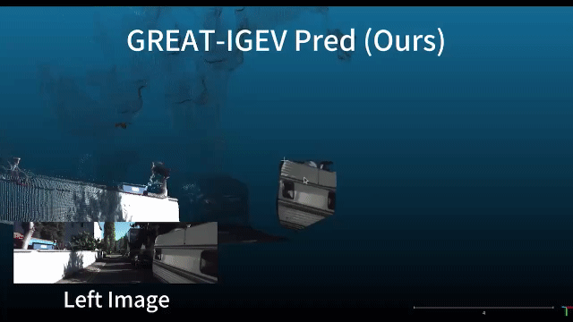
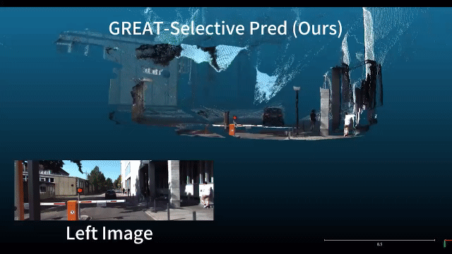
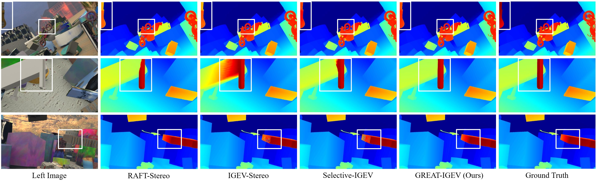
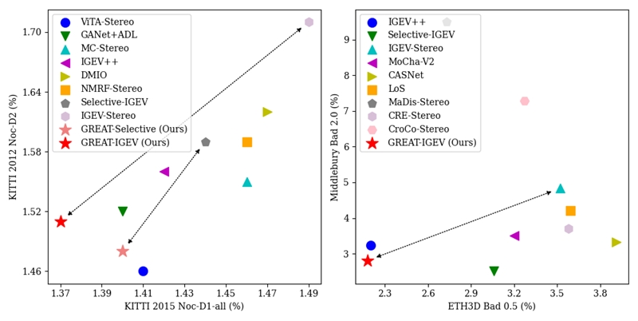
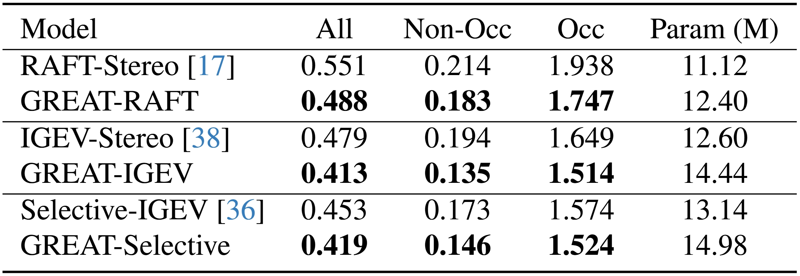

# :rocket: GREAT-Stereo (ICCV 2025) :rocket:
This repository contains the source code for our paper:

**Global Regulation and Excitation via Attention Tuning for Stereo Matching (GREAT-Stereo)**

Jiahao LI, Xinhong Chen, Zhengmin JIANG, Qian Zhou, Yung-Hui Li, Jianping Wang

  </img>

## :bulb: Abstract
Stereo matching achieves significant progress with iterative algorithms like RAFT-Stereo and IGEV-Stereo. However, these methods struggle in ill-posed regions with occlusions, textureless, or repetitive patterns, due to a lack of global context and geometric information for effective iterative refinement. To enable the existing iterative approaches to incorporate global context, we propose the **G**lobal **R**egulation and **E**xcitation via **A**ttention **T**uning (**GREAT**) framework which encompasses three attention modules. Specifically, Spatial Attention (SA) captures the global context within the spatial dimension, Matching Attention (MA) extracts global context along epipolar lines, and Volume Attention (VA) works in conjunction with SA and MA to construct a more robust cost-volume excited by global context and geometric details. To verify the universality and effectiveness of this framework, we integrate it into several representative iterative stereo-matching methods and validate it through extensive experiments, collectively denoted as GREAT-Stereo. This framework demonstrates superior performance in challenging ill-posed regions. Applied to IGEV-Stereo, among all published methods, our GREAT-IGEV ranks first on the Scene Flow test set, KITTI 2015, and ETH3D leaderboards, and achieves second on the Middlebury benchmark.

## :clapper: Demo & Results:

<table align="center" width="100%" style="border-collapse: collapse; margin: 20px 0;">
  <tr>
    <td align="center" width="33%">
      </img>
      
RAFT Demo

    </td>
    <td align="center" width="33%">
      </img>
      
IGEV Demo

    </td>
    <td align="center" width="33%">
      </img>
      
Selective Demo

    </td>
  </tr>
</table>

  </img>

Qualitative results of GREAT-IGEV on the Scene Flow test set of occlusion (**Row 1**), textureless (**Row 2**), and repetitive texture (**Row 3**) regions.

  </img>

  </img>

Comparisons with state-of-the-art stereo methods on different public benchmarks and ablation study of the cross-model transferability of the proposed GREAT framework on the Scene Flow test set.
