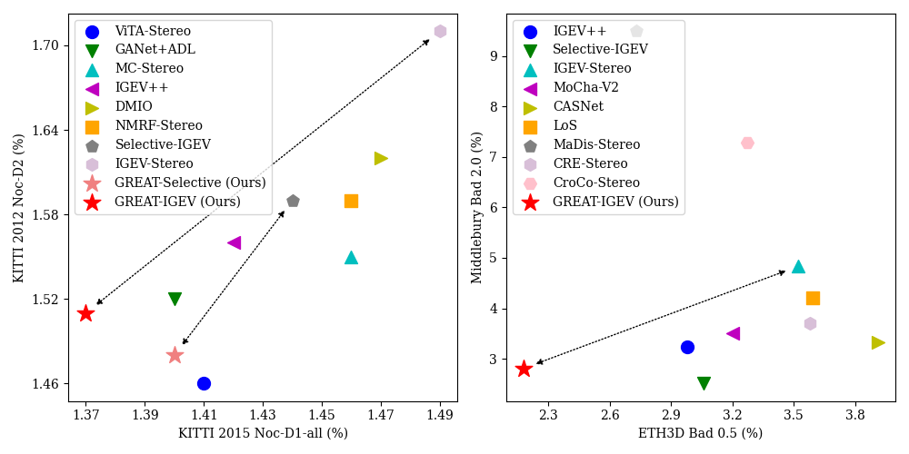

# :rocket: GREAT-Stereo (ICCV 2025) :rocket:
This repository contains the source code for our paper:

**Global Regulation and Excitation via Attention Tuning for Stereo Matching (GREAT-Stereo)**
<a href="TBC">
  
</a>

Jiahao LI, Xinhong Chen, Zhengmin JIANG, Qian Zhou, Yung-Hui Li, Jianping Wang

<p align="center"></p>
<div align="center">
  </img>
</div>
<p></p>

## :bulb: Abstract
Stereo matching achieves significant progress with iterative algorithms like RAFT-Stereo and IGEV-Stereo. However, these methods struggle in ill-posed regions with occlusions, textureless, or repetitive patterns, due to a lack of global context and geometric information for effective iterative refinement. To enable the existing iterative approaches to incorporate global context, we propose the **G**lobal **R**egulation and **E**xcitation via **A**ttention **T**uning (**GREAT**) framework which encompasses three attention modules. Specifically, Spatial Attention (SA) captures the global context within the spatial dimension, Matching Attention (MA) extracts global context along epipolar lines, and Volume Attention (VA) works in conjunction with SA and MA to construct a more robust cost-volume excited by global context and geometric details. To verify the universality and effectiveness of this framework, we integrate it into several representative iterative stereo-matching methods and validate it through extensive experiments, collectively denoted as GREAT-Stereo. This framework demonstrates superior performance in challenging ill-posed regions. Applied to IGEV-Stereo, among all published methods, our GREAT-IGEV ranks first on the Scene Flow test set, KITTI 2015, and ETH3D leaderboards, and achieves second on the Middlebury benchmark.

## :clapper: Demos & Results
<p align="center"></p>
<table align="center" width="100%" style="border-collapse: collapse; margin: 20px 0;">
  <tr>
    <td align="center" width="33%">
      </img>
      <div style="margin-top: 8px; font-weight: bold;">RAFT Demo</div>
    </td>
    <td align="center" width="33%">
      </img>
      <div style="margin-top: 8px; font-weight: bold;">IGEV Demo</div>
    </td>
    <td align="center" width="33%">
      </img>
      <div style="margin-top: 8px; font-weight: bold;">Selective Demo</div>
    </td>
  </tr>
</table>
<p></p>

<p align="center"></p>
<div align="center">
  </img>
</div>
<p></p>

Qualitative results of GREAT-IGEV on the Scene Flow test set of occlusion (**Row 1**), textureless (**Row 2**), and repetitive texture (**Row 3**) regions.

<p align="center"></p>
<div align="center">
  </img>
</div>
<div align="center">
  </img>
</div>
<p></p>

Comparisons with state-of-the-art stereo methods on different public benchmarks and ablation study of the cross-model transferability of the proposed GREAT framework on the Scene Flow test set.

## :gear: Environment Settings

* NVIDIA RTX 3090 or 4090
* python 3.8
  
```Shell
conda create -n great python=3.8
conda activate great

pip install torch==2.0.1 torchvision==0.15.2 torchaudio==2.0.2 --index-url https://download.pytorch.org/whl/cu118
pip install tqdm==4.67.1
pip install scipy==1.10.1
pip install opencv-python==4.11.0.86
pip install scikit-image==0.21.0
pip install tensorboard==2.12.0
pip install matplotlib==3.7.5
pip install timm==0.5.4
pip install numpy==1.24.1
pip install einops==0.8.1
```

## :floppy_disk: Required Data

* [SceneFlow](https://lmb.informatik.uni-freiburg.de/resources/datasets/SceneFlowDatasets.en.html)
* [KITTI](https://www.cvlibs.net/datasets/kitti/eval_scene_flow.php?benchmark=stereo)
* [ETH3D](https://www.eth3d.net/datasets)
* [Middlebury](https://vision.middlebury.edu/stereo/submit3/)
* [TartanAir](https://github.com/castacks/tartanair_tools)
* [VKITTI2](https://europe.naverlabs.com/research/proxy-virtual-worlds/)
* [CREStereo Dataset](https://github.com/megvii-research/CREStereo)
* [FallingThings](https://research.nvidia.com/publication/2018-06_falling-things-synthetic-dataset-3d-object-detection-and-pose-estimation)
* [InStereo2K](https://github.com/YuhuaXu/StereoDataset)
* [Sintel Stereo](http://sintel.is.tue.mpg.de/stereo)
* [HR-VS](https://drive.google.com/file/d/1SgEIrH_IQTKJOToUwR1rx4-237sThUqX/view)

## :test_tube: Evaluation

1. Download the Checkpoints from [Google Drive](https://drive.google.com/drive/folders/1EZ_hScBixV9opzX7W3ItJXlqS5uNKZvJ?usp=drive_link).

2. Change the following parameters in the script located at `launchers/stereo_matching/test_launcher/`.
    - `dataset`
      - Choices => [sceneflow, kitti, eth3d, middlebury_(Q | H | F)]
    - `dataset_root`
      - your/path/to/corresponding/dataset
    - `restore_ckpt`
      - your/path/to/checkpoint

3. Run the evaluation (e.g. Evaluation of GREAT-IGEV on Scene Flow test set).
```Shell
./launchers/stereo_matching/test_launcher/great_igev_evaluator.sh
```

4. (Optional) You can also change the `eval_mode` in the evaluation script to get different evaluation results:
    - `metric` to generate evaluation quantity results (Default).
    - `pcgen` to generate the points cloud of predicted disparity for visualization.
    - `cvvis` to generate the visualization of the cost volume.

## :books: Training

1. Change the following parameters in the script located at `launchers/stereo_matching/train_launcher/`
    - `logdir`
      - your/path/to/save/training/information
    - `train_datasets`
      - Choices => [sceneflow, vkitti2, kitti, eth3d_train, eth3d_finetune, middlebury_train, middlebury_finetune]
    - `train_datasets_root`
      - your/path/to/corresponding/dataset
    - `restore_ckpt` (Optional)
      - your/path/to/checkpoint/for/finetuning

2. Run the training (e.g. Training of GREAT-IGEV on Scene Flow test set).
```Shell
./launchers/stereo_matching/train_launcher/great_igev_trainer.sh
```

3. (Optional) You can also change the trainer in the script from `stereo_trainer.py` to `stereo_resumable_trainer.py`, which can resume the training if the training process has been accidentally shut down. The `stereo_resumable_trainer.py` will save checkpoints for model, optimizer, and learning rate scheduler for resuming.

4. (Optional) Thanks for the repository of [IGEV-Stereo](https://github.com/gangweix/IGEV/tree/main), we also provide the choices of the data type in mixed precision training. You can change this data type with `precision_dtype` in the script. Choices are `float32`, `float16`, and `bfloat16`. Default value is `float16`. 
**__NOTE__: Our provided checkpoints are trained with `float16` and `float32`.**

## :package: Submission

For submission to the KITTI benchmark (e.g. GREAT-IGEV).
```Shell
python3 save_disp_kitti.py --name great-igev-stereo --restore_ckpt your/path/to/checkpoint --left_imgs your/path/to/left/imgs --right_imgs your/path/to/right/imgs --output_directory your/path/to/save/submission/results
```

For submission to the ETH3D benchmark (e.g. GREAT-IGEV).
```Shell
python3 save_disp_eth3d.py --name great-igev-stereo --restore_ckpt your/path/to/checkpoint --left_imgs your/path/to/left/imgs --right_imgs your/path/to/right/imgs --output_directory your/path/to/save/submission/results
```

For submission to the Middlebury benchmark (e.g. GREAT-IGEV).
```Shell
python3 save_disp_middlebury.py --name great-igev-stereo --restore_ckpt your/path/to/checkpoint --left_imgs your/path/to/left/imgs --right_imgs your/path/to/right/imgs --output_directory your/path/to/save/submission/results
```

## :open_book: Citation

If you find our works useful in your research, please consider citing our paper.
```bibtex
TBC
```

## Acknowledgements
TBC
