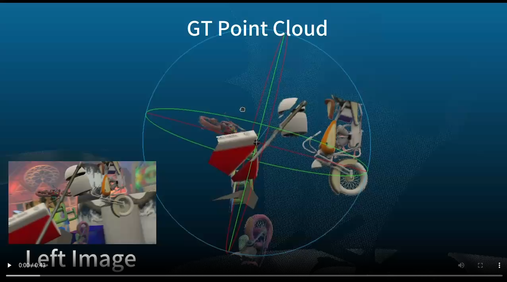
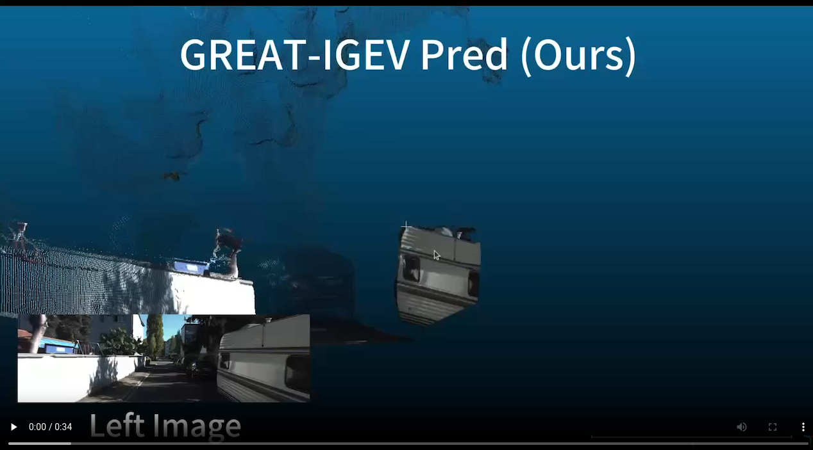
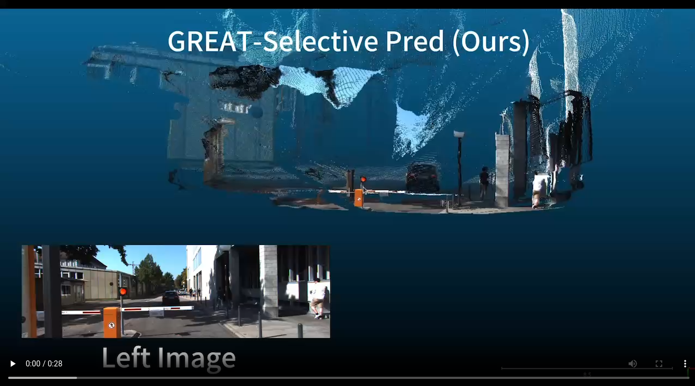

# <a href="https://www.youtube.com/watch?v=u-UhFMGmXro" style="color: #FFFFFF; text-decoration: none;">:rocket: GREAT-Stereo (ICCV 2025) :rocket:</a>

<h2>🤗 Demo Results:</h2>
<table align="center" width="100%" style="border-collapse: collapse; margin: 20px 0; border: none; border-spacing: 0;">
  <tr>
    <td align="center" width="33%" style="border: none; padding: 5;">
      
      
RAFT Demo

    </td>
    <td align="center" width="33%" style="border: none; padding: 5;">
      
      
IGEV Demo

    </td>
    <td align="center" width="33%" style="border: none; padding: 5;">
      
      
Selective Demo

    </td>
  </tr>
</table>

This repository contains the source code for our paper:

**Global Regulation and Excitation via Attention Tuning for Stereo Matching (GREAT-Stereo)**
<!--  --!>
